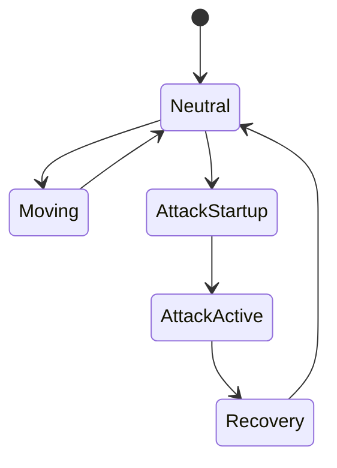

# ⚔️ Fencing FTG（Épée）  
## Distance-Based Fighting Game with Gym Environment

> 一個以 **西洋劍（重劍 Épée）** 為核心的  
> **距離壓制型 FTG（Fighting Game）+ AI 訓練環境**

技術導向：  
**Python / FastAPI / WebSocket / MVCS / OOP / Docker / Gym / RL**

---

## 1️⃣ 專案簡介（README）

### 專案目標
這不是一個靠連段或動畫取勝的格鬥遊戲，而是：
- 比距離
- 比時機
- 比決策
- 比 AI 是否真的理解戰鬥

設計目的：
- 最小可玩 FTG Prototype
- 可作為強化學習（RL）環境
- Rule-based → RL → Self-play 漸進式研究

---

## 2️⃣ 遊戲規則與距離壓制（SPEC）

### 武器規則：重劍 Épée
- 全身有效部位
- 無優先權（Right-of-Way）
- 允許 Double Touch
- 先到指定分數（預設 5）獲勝

### 距離模型
| 區間 | 條件 | 效果 |
|----|----|----|
| 太近 | d < min_range | 命中率低 |
| 最佳 | min_range ≤ d ≤ best_range | 命中率最高 |
| 過遠 | d > best_range | 幾乎無法命中 |

---

## 3️⃣ 狀態機（FSM）



---

## 4️⃣ AI 與 Gym 環境

### Gym ID
FencingEpeeEnv-v0

### Action Space
0 idle  
1 step_forward  
2 step_back  
3 thrust  
4 lunge  
5 beat  

### Reward
- +1 得分
- -1 被得分
- -0.2 Double Touch
- -0.001 每 tick

---

## 5️⃣ 技術架構（MVCS + OOP）

```text
fencing-ftg/
├─ app/
│  ├─ main.py
│  ├─ ws.py
│  ├─ game/
│  │  ├─ engine.py
│  │  ├─ services/
│  │  └─ controllers/
├─ docker/
│  └─ Dockerfile
├─ docker-compose.yml
└─ requirements.txt
```

---

## 結語
This project is **AI-first**, low animation cost, high decision density.
